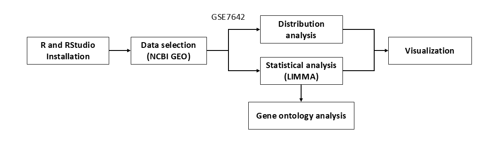
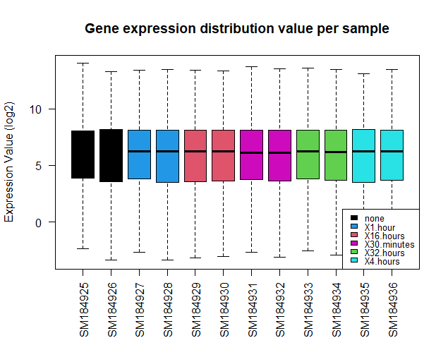
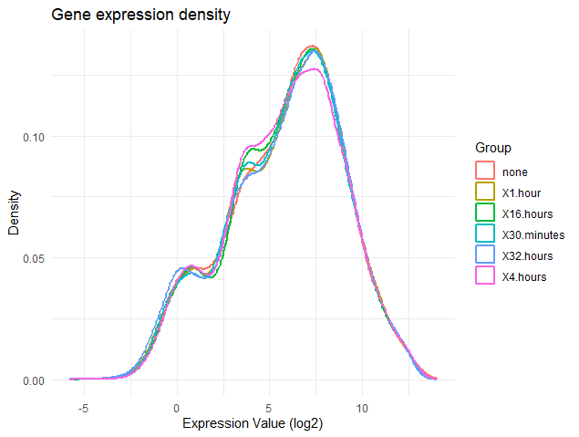
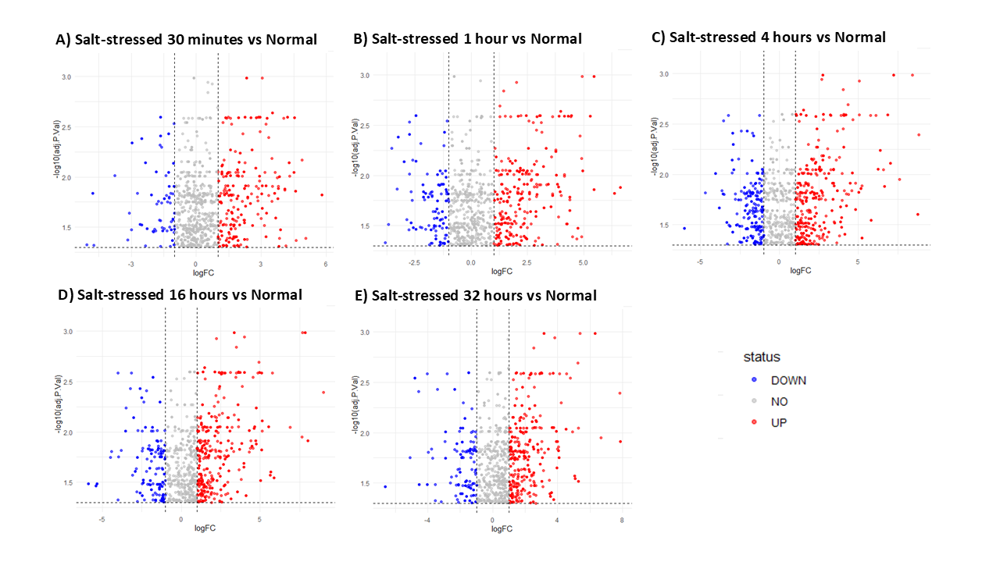
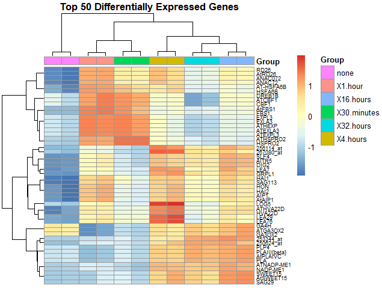

# Capstone Project

## `Study Workflow`

## Case: Salt stress response in _Arapidopsis thaliana_ ecotype Columbia (Col-0)
### Tools: GEO, R (R/Rstudio), ShinyGo 
A project-based learning to conduct differential gene expression analysis of transcription data from GSE7642 dataset obtained from NCBI GEO

## Steps in differential gene expression analysis
1. Install [R ver. 4.5.2](<https://www.r-project.org>) and [RStudio](<https://posit.co/download/rstudio-desktop/>)
2. Select the data, in this case [GSE7642](<https://www.ncbi.nlm.nih.gov/geo/query/acc.cgi?acc=GSE7642>)
3. (Optional) Explore the data with web-based tool analysis, GEO2R
4. Install R packages and load the libraries
5. Download GSE7642 dataset to R
6. Pre-process and group the data into six: none, X30.minutes, X1.hour, X4.hours, X16.hours, and X32.hours
7. Create a statistical framework by comparing all the salt treatment time points with normal condition
8. Run the codes for differential gene expression analysis and visualization [Check the code here](Script/Coding_GSE7642.R)
9. Export and save the plots as image

## The Result

10. Generate top 50 symbol for gene ontology analysis
11. Save the project

## Steps in gene ontology (GO) analysis
1. Browse [ShinyGo](<https://biit.cs.ut.ee/gprofiler/gost>)
2. Change the species into _A. thaliana_ araport 11 database
3. Attach the top 50 gene list generated from R
4. Run the analisis
5. Explore the result visualization and choose one that fits the report

### Result interpretation
[Check my report here](Report/311_Agnes Faustina_Week 4.pdf)
